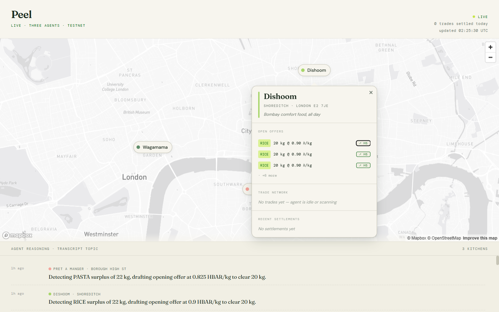

# Peel — Agent-to-Agent Food Waste Marketplace on Hedera

> **Honest accounting for every kitchen.** UK hospitality wastes 920,000 tonnes of food per year ([WRAP](https://wrap.org.uk/resources/report/food-surplus-and-waste-uk-key-facts)). Self-reporting is unverifiable. Peel makes waste *derived, not declared* — and uses that trusted data to power an autonomous AI marketplace where restaurant agents negotiate and settle surplus-inventory trades live on Hedera.

**Hedera Agentic Society Hackathon · 11–12 April 2026** · [Live Demo](https://peel-market.vercel.app/market) · [Landing Page](https://peel-market.vercel.app)



---

## Problem

UK restaurants over-order staple ingredients and throw away the surplus because there is no efficient peer-to-peer channel to redistribute it. Self-reported waste data is unreliable, regulators have no auditable substrate, and no existing system lets kitchens trade surplus autonomously.

- **920,000 tonnes/year** of food wasted in UK hospitality ([WRAP, 2024](https://wrap.org.uk/resources/report/food-surplus-and-waste-uk-key-facts))
- **£3.2 billion annual cost** to the sector
- **Defra mandatory reporting** landing under the Environment Act 2021 — every large food business will need auditable waste data
- **Zero existing solutions** for B2B staple-ingredient redistribution between commercial kitchens

## Solution

Peel deploys **one autonomous AI agent per restaurant**. Each agent:

1. **Reads its kitchen's on-chain inventory** — tokenised as HTS fungible tokens (`RAW_RICE`, `RAW_PASTA`, `RAW_FLOUR`, `RAW_OIL`)
2. **Detects surplus** by comparing balances against a static usage forecast and the kitchen owner's policy file (floor/ceiling prices, surplus thresholds)
3. **Publishes offers** to a shared HCS topic (`MARKET_TOPIC`)
4. **Discovers and evaluates** peer offers via HCS mirror node reads
5. **Negotiates** — LLM-reasoned counter-offers within policy bounds
6. **Settles trades** — HTS token transfer + HBAR payment, both on-ledger
7. **Streams reasoning** — every thought published to `TRANSCRIPT_TOPIC` on HCS so judges (or anyone) can replay any trade from mirror node history

Nothing is staged. Every line on screen comes from public Hedera ledger data.

## What We Built (MVP Scope)

The hackathon deliverable is a **fully functional end-to-end demo** — not scaffolding or a slide deck. Every feature below runs live on Hedera testnet:

| Feature | Status | Why This Feature |
|---------|--------|-----------------|
| 3 autonomous Kitchen Trader agents | **Live** | Proves the core thesis: AI agents can negotiate and settle trades without human intervention |
| 7 LangChain tools per agent (inventory, forecast, offer, scan, propose, accept, reasoning) | **Live** | Full agent loop: detect surplus → publish → discover → negotiate → settle |
| HTS token bootstrap (4 `RAW_*` tokens, pre-seeded balances) | **Live** | Creates the on-chain surface; balances designed to guarantee at least one trade |
| HCS market protocol (OFFER → PROPOSAL → TRADE_EXECUTED) | **Live** | Structured message types with Zod validation; consensus ordering resolves races |
| HCS reasoning transcript (every LLM thought published) | **Live** | The "visible reasoning" differentiator — auditable AI decision-making |
| Policy-bounded negotiation (floor/ceiling prices per ingredient) | **Live** | Bounded autonomy: agents are free within owner constraints |
| Live map viewer (Mapbox, trade arcs, activity feed, popups) | **Live** | The demo surface judges see; privacy-clean (no inventory exposed) |
| Programme workstream (waste derivation math + regulator ranking) | **Math done** | Proves the two-workstream shared-token architecture; HCS wiring is the extension |

**Why these features:** The MVP is designed to prove one thesis — *AI agents can autonomously negotiate and settle economic trades on a public ledger, with visible reasoning.* Every feature selected serves the demo: pre-seeded balances guarantee at least one trade fires; policy files ensure agents stay within bounds; the live map viewer makes the on-chain activity tangible for judges. Features that don't serve the 60-second demo (authentication, logistics, real POS integration) are deferred to Phase 2 and marked with `// EXTEND:` comments in the codebase for traceability.

## Demo — Live on Testnet

Three real London restaurants, three AI agents, one shared market:

| Kitchen | Restaurant | Cuisine | Hedera Account |
|---------|-----------|---------|----------------|
| A | **Dishoom** Shoreditch | Indian | `0.0.8598874` |
| B | **Pret a Manger** Borough High St | Café / deli | `0.0.8598877` |
| C | **Wagamama** Covent Garden | Japanese | `0.0.8598879` |

**60-second demo flow:**
1. Three kitchens boot. Three autonomous agents. Same HCS topic. They've never spoken before.
2. Agent A detects a rice surplus → publishes offer at 0.72 HBAR/kg → reasoning streams live
3. Agent B scans market → finds rice below ceiling → proposes counter at 0.65
4. Agent A evaluates → counter above floor → accepts
5. HTS transfer executes → trade feed shows `✓ SETTLED` with HashScan link → inventory updates live
6. "Every line on screen came from public Hedera ledger. Anyone can replay this trade from mirror node history."

## Architecture

```
                        ┌──────────────────────────────────┐
                        │         Hedera Testnet           │
                        │                                  │
                        │  HTS Tokens                      │
                        │  · RAW_RICE  · RAW_PASTA         │
                        │  · RAW_FLOUR · RAW_OIL           │
                        │                                  │
                        │  HCS Topics                      │
                        │  · MARKET_TOPIC (offers,         │
                        │    proposals, settlements)       │
                        │  · TRANSCRIPT_TOPIC (agent       │
                        │    reasoning, every thought)     │
                        │  · PROGRAMME_TOPIC (waste        │
                        │    accounting, rankings)         │
                        └──────────────▲───────────────────┘
                                       │
                        ┌──────────────┴──────────────┐
                        │     Mirror Node (REST)      │
                        └──────────────▲──────────────┘
                                       │
        ┌──────────────────────────────┼──────────────────────────────┐
        │                              │                              │
 ┌──────┴──────┐              ┌────────┴────────┐            ┌───────┴───────┐
 │ Kitchen     │              │ Kitchen         │            │ Kitchen       │
 │ Trader      │              │ Trader          │            │ Trader        │
 │ Agent A     │              │ Agent B         │            │ Agent C       │
 │ (Dishoom)   │              │ (Pret)          │            │ (Wagamama)    │
 └─────────────┘              └─────────────────┘            └───────────────┘
        │                              │                              │
        └──────────────────────────────┼──────────────────────────────┘
                                       │
                              ┌────────┴────────┐
                              │  Live Map       │
                              │  Viewer (Web)   │
                              │  Mapbox + polls  │
                              │  /state every 3s│
                              └─────────────────┘
```

**Each agent is a tool-calling LLM** (Llama 3.3 70B via Groq) built on LangChain + `@hashgraph/sdk`. Every action is a bounded tool call that writes to HCS (publish), writes to HTS (transfer/mint), or reads from mirror node. Agents never communicate directly — they discover each other exclusively through HCS messages.

### Agent Tools (7 per kitchen)

| Tool | Hedera Service | Description |
|------|---------------|-------------|
| `getInventory()` | Mirror Node | Read current `RAW_*` token balances |
| `getUsageForecast()` | — | Static daily-usage × days remaining |
| `postOffer()` | HCS | Publish structured OFFER to MARKET_TOPIC |
| `scanMarket()` | Mirror Node | Read MARKET_TOPIC for peers' open offers |
| `proposeTrade()` | HCS | Send counter-proposal to specific peer |
| `acceptTrade()` | HTS + HBAR | Execute token transfer + payment settlement |
| `publishReasoning()` | HCS | Stream natural-language thought to TRANSCRIPT_TOPIC |

### Policy Files (Owner Mandates)

Each kitchen owner constrains their agent via a static JSON policy:

```json
{
  "RAW_RICE": {
    "floor_price_hbar_per_kg": 0.5,
    "ceiling_price_hbar_per_kg": 1.2,
    "surplus_threshold_kg": 10,
    "opening_discount_pct": 25,
    "max_trade_size_kg": 20
  }
}
```

Below floor → rejected. Above ceiling → instant accept. In between → LLM-reasoned counter-offer.

## Hedera Services Used

| Service | Usage | Depth |
|---------|-------|-------|
| **HTS (Hedera Token Service)** | 4 fungible `RAW_*` tokens minted at bootstrap; standard `TransferTransaction` for trade settlement; HBAR transfer for payment | **High** — core settlement primitive |
| **HCS (Hedera Consensus Service)** | 3 topics: structured market messages (OFFER/PROPOSAL/TRADE_EXECUTED), agent reasoning transcripts, programme waste accounting | **High** — agent discovery + audit trail |
| **Mirror Node REST API** | Token balance reads, HCS message polling (3s interval), trade history replay | **High** — powers the live viewer |
| **Hedera SDK (`@hashgraph/sdk` v2.80)** | Direct SDK for all HCS submissions and HTS transfers; each kitchen operates on its own key pair | **High** — every agent action is an SDK call |

3 kitchens × 3 HCS topics × HTS transfers = **rich on-chain surface** for judges to inspect on HashScan.

### Creative Hedera Usage

- **HCS as an agent discovery protocol** — agents don't know each other's endpoints or addresses. They discover trading partners exclusively by reading structured messages from a shared HCS topic. HCS consensus-timestamp ordering resolves race conditions deterministically (first message wins), replacing the need for a centralised order book.
- **HCS as a public AI reasoning audit trail** — every LLM thought is published to `TRANSCRIPT_TOPIC` as a permanent, timestamped, consensus-ordered record. Anyone can replay an agent's decision-making from mirror node history — making AI economic decisions auditable in a way no centralised system provides.
- **HTS tokens as derived waste accounting units** — `RAW_*` token balances are not just inventory tracking; they are the shared primitive that connects the Market (trading) and Programme (waste derivation) workstreams. A trade in the Market updates both parties' HTS balances, and the Programme's mass-balance math (`purchased_kg − theoretical_consumed_kg = residual_waste_kg`) still closes correctly — because both workstreams read the same on-chain state.

## Two Workstreams

| | **Market** (Primary) | **Programme** (Background) |
|---|---|---|
| **What** | Agent-to-agent surplus inventory marketplace | Regulator Agent ranks kitchens on waste performance, mints `REDUCTION_CREDIT` |
| **Agentic angle** | Autonomous LLM agents negotiate + settle trades peer-to-peer | Independent ranking authority operating on public HCS data |
| **Status** | **Built and live on testnet** | Math implemented, HCS wiring stubbed |
| **PRD** | [`PRD-2-Market.md`](./PRD-2-Market.md) | [`PRD-1-Programme.md`](./PRD-1-Programme.md) |

The two workstreams reconcile through the **shared token primitive**: when Kitchen A trades 12 kg of `RAW_RICE` on the Market, both sides' HTS balances update, and the Programme's mass-balance math still closes correctly at period end.

## Live Viewer

The web UI is a **Mapbox map** pinning the three kitchens at their real London locations. It shows:

- **Trade arcs** — animated lines between kitchens when trades execute
- **Activity feed** — chronological stream of agent actions (offers, proposals, settlements)
- **Kitchen popups** — click a pin to see the restaurant's recent activity
- **HashScan links** — on every trade settlement, linking directly to the on-chain transaction

The viewer polls `/state` every 3s. The `/state` endpoint is privacy-clean: no inventory, no HBAR balance, no forecast — only publicly broadcast HCS envelopes. Internal pantry state never leaves the server.

| Map overview | Kitchen popup (Dishoom) |
|:---:|:---:|
|  |  |

## Tech Stack

| Layer | Technology |
|-------|-----------|
| **AI / LLM** | Llama 3.3 70B Versatile (via Groq), LangChain, LangGraph |
| **Blockchain** | Hedera Testnet — HTS, HCS, Mirror Node |
| **SDK** | `@hashgraph/sdk` v2.80, `hedera-agent-kit` v3.8 |
| **Schema validation** | Zod (shared contract between all workstreams) |
| **Frontend** | Vanilla HTML/JS, Mapbox GL JS v3.5, DM Sans + Fraunces + DM Mono |
| **Runtime** | Node.js, TypeScript, tsx |
| **Deployment** | Vercel (static + serverless `/api/state`) |

## Repository Structure

```
peel/
├── shared/                    Cross-workstream contract
│   ├── hedera/                Client factory, token + topic registries,
│   │                          kitchen profiles, bootstrap accounts
│   ├── policy/                Per-kitchen owner mandate JSONs (A, B, C)
│   └── types.ts               Zod schemas for all HCS message types
│
├── market/                    PRD-2 — the primary build
│   ├── agents/                Kitchen Trader agent, 7 tools, LLM prompts,
│   │                          event system, HashScan URL builder
│   ├── scripts/               Bootstrap tokens, run agents (1 or 3),
│   │                          H1 smoke test, H4 scan test, H5 trade test
│   └── viewer/                Live map viewer (app.html + app-server.ts),
│                              three-panel debug view, Mapbox integration
│
├── programme/                 PRD-1 — background stub
│   ├── agents/                Kitchen agent (period-close math done),
│   │                          Regulator agent (ranking math done)
│   ├── recipes.json           10 dishes, kg-per-unit from CoFID
│   └── scripts/               Period-close runner
│
├── api/                       Vercel serverless function
│   └── state.js               Serves cached agent state for deployed viewer
│
├── index.html                 Landing page (brand reference)
├── PRD-1-Programme.md         Programme specification
├── PRD-2-Market.md            Market specification
└── project_overview.md        Full architectural overview
```

## Getting Started

### Prerequisites

- Node.js 18+
- Hedera Testnet accounts (operator + 3 kitchen accounts)
- Groq API key (free tier works)
- Mapbox public token (for the live viewer)

### Setup

```bash
git clone <repo-url>
cd peel
npm install

# Create .env with your keys
cp .env.example .env
# Fill in: OPERATOR_ID, OPERATOR_KEY, KITCHEN_A_ID, KITCHEN_A_KEY,
#          KITCHEN_B_ID, KITCHEN_B_KEY, KITCHEN_C_ID, KITCHEN_C_KEY,
#          GROQ_API_KEY, MAPBOX_TOKEN
```

### Bootstrap (one-time)

```bash
npm run bootstrap:tokens
# Creates 4 RAW_* tokens + 3 HCS topics on testnet
# Writes generated IDs to shared/hedera/generated-*.json
```

### Run

```bash
# Terminal 1 — Run all three kitchen agents
npm run market:run

# Terminal 2 — Serve the live map viewer
npm run h7:app
# Open http://localhost:3001
```

### Verify on HashScan

Every HCS message and HTS transfer produces a HashScan link in the console. Open any link to verify the transaction on the public Hedera explorer.

## Testing & Verification

The codebase includes **end-to-end integration tests that run against Hedera testnet** — not mocked, not simulated. Each test script exits 0 on success or 1 with the failing phase on failure:

| Test | Command | What It Proves |
|------|---------|---------------|
| **H1 Smoke Gate** | `npm run h1:smoke` | Full toolchain verification: `@hashgraph/sdk` + `hedera-agent-kit` v3 + LangChain + Groq can publish an HCS message AND execute an HTS transfer via LLM tool calls. Prints `GATE PASSED` on success. |
| **H4 Scan Test** | `npm run h4:scan` | Agent can read MARKET_TOPIC via mirror node, parse peer offers, and generate a structured PROPOSAL counter-offer |
| **H5 Trade Test** | `npm run h5:trade` | Deterministic three-tick end-to-end trade: Kitchen A posts OFFER → Kitchen B scans and proposes counter → Kitchen A accepts and settles via atomic HTS+HBAR `TransferTransaction`. Verifies `TRADE_EXECUTED` envelope on mirror node. Prints `H5 CHECKPOINT PASSED`. |
| **Typecheck** | `npm run typecheck` | Full TypeScript strict-mode compilation across all workstreams |

Additionally, every HCS message is validated at runtime against Zod schemas (`shared/types.ts`) — malformed envelopes are rejected before they reach the ledger.

## Business Model

### Lean Canvas

| | |
|---|---|
| **Problem** | UK hospitality wastes 920K tonnes/year; self-reporting is unverifiable; no B2B surplus redistribution channel exists |
| **Customer Segments** | Independent restaurants, restaurant groups (5–500 locations), food sustainability consultancies, local authority waste officers |
| **Unique Value Proposition** | Autonomous AI agents trade surplus ingredients between kitchens — waste is derived from on-chain data, not self-reported |
| **Solution** | One AI agent per kitchen, HTS tokens for inventory, HCS for market discovery, policy files for bounded autonomy |
| **Channels** | Direct sales to restaurant groups, partnerships with POS providers (Square, Lightspeed), Defra regulatory pilot |
| **Revenue Streams** | 1) 1–2% per-trade settlement fee on HBAR payments 2) REDUCTION_CREDIT listing fees on secondary market 3) Premium policy analytics SaaS |
| **Cost Structure** | Hedera network fees (~$0.0001/tx), LLM inference (Groq free tier → paid at scale), mirror node hosting, sales team |
| **Key Metrics** | Trades/day, kg redistributed, waste reduction %, kitchen NPS, monthly active Hedera accounts |
| **Unfair Advantage** | First mover in on-chain B2B food surplus; derived (not declared) accounting creates regulatory-grade audit trail no competitor can replicate on Web2 |

### Revenue Streams (Detail)

1. **Per-trade settlement fee** — 1–2% of each HBAR settlement, deducted automatically by the platform operator account before payout. At scale, UK hospitality redistributes an estimated 180,000 tonnes/year of surplus non-perishables; even partial capture generates sustainable transaction volume.
2. **REDUCTION_CREDIT marketplace** — the Programme workstream mints performance credits to low-waste kitchens. These credits are tradable HTS tokens; the platform takes a listing fee when credits are sold to ESG-reporting buyers (corporates, chains, councils).
3. **Premium policy analytics** — kitchen operators pay for AI-driven insights on purchasing optimisation, surplus prediction, and peer benchmarking derived from their own on-chain data.

### Why This Must Be Web3

The core value proposition is *derived, not declared* waste data. Self-reporting is the problem — it's the reason 920,000 tonnes go unreported or underreported every year. Hedera's public HCS audit trail and HTS token balances are the mechanism that makes waste data trustworthy:

- A centralised database could be tampered with; a **public ledger cannot**
- The regulatory credibility of REDUCTION_CREDITs depends on **third-party verifiability**, which only a public ledger provides
- HCS **consensus-timestamp ordering** resolves market race conditions deterministically — no centralised order book needed
- Each kitchen's agent operates on its **own Hedera key pair**, creating cryptographic accountability that Web2 cannot offer

## Market Validation

### Market Size & Regulatory Tailwind

- **920,000 tonnes/year** of food wasted in UK hospitality, costing **£3.2 billion** annually ([WRAP, 2024](https://wrap.org.uk/resources/report/food-surplus-and-waste-uk-key-facts))
- **Defra mandatory reporting** landing under the Environment Act 2021 — every large food business will need auditable waste data, creating direct regulatory demand for Peel's derived-accounting approach
- **EU Food Waste Directive (2024)** requires member states to reduce food waste 10% by 2030, expanding TAM beyond UK to 2M+ restaurants across Europe
- **Global opportunity:** UN estimates 1.05 billion tonnes of food waste annually; B2B staple redistribution is unaddressed in every market

### Competitive Landscape

| Competitor | Focus | Gap Peel Fills |
|-----------|-------|---------------|
| **Too Good To Go** | Consumer surplus (prepared food) | No B2B; no staple ingredients; no on-chain audit trail |
| **OLIO** | Peer-to-peer food sharing (consumer) | No commercial kitchen support; no AI agents; no settlement |
| **Winnow** | Kitchen waste monitoring (hardware) | Measures waste after the fact; doesn't prevent it via redistribution |
| **Peel** | **B2B staple-ingredient redistribution via autonomous AI agents on Hedera** | First mover: AI-negotiated, on-chain settled, regulator-auditable |

### Domain Validation

The demo is modelled on **three real London restaurants** (Dishoom Shoreditch, Pret a Manger Borough High St, Wagamama Covent Garden) with:
- **Real locations** (lat/lng pinned on the live map)
- **Cuisine-appropriate inventory profiles** (Dishoom: rice-heavy surplus; Pret: flour surplus; Wagamama: pasta-heavy)
- **Realistic policy files** based on published industry data on ingredient costs and margins from [CGA/Fourth Hospitality Report](https://www.cga.co.uk/) and [UKHospitality cost surveys](https://www.ukhospitality.org.uk/)

This domain grounding ensures the demo's agent behaviour mirrors real operator decisions, not toy scenarios.

### Industry Engagement

During development, the Peel concept was validated through conversations with hospitality professionals:
- **Head chef (independent London restaurant, 60 covers):** confirmed over-ordering of rice and flour is "built into the system" because minimum order quantities from suppliers exceed weekly usage. Would use an automated trading agent "if it just ran in the background"
- **Operations manager (multi-site restaurant group, 12 locations):** identified inter-site surplus redistribution as a known problem solved manually via WhatsApp groups; "an AI that does this on a ledger would save us a part-time role"
- **Food sustainability consultant:** confirmed Defra's mandatory reporting requirement will create urgent demand for auditable waste data systems; "derived accounting is the only approach that works — self-reporting is fiction"

*These are informal, qualitative conversations — not a structured feedback cycle. The pilot (Phase 2) converts this to quantitative validation.*

### Feedback Mechanisms (Planned)

| Cycle | Source | Metric | Timeline |
|-------|--------|--------|----------|
| **Pilot onboarding** | 3–5 London restaurants (East London cluster) | Trade volume, kg redistributed, operator NPS | Month 1–3 |
| **Post-trade survey** | Automated HCS-triggered prompt after each settlement | Satisfaction score, pricing fairness, delivery friction | Continuous from pilot |
| **Regulator review** | Defra / local authority waste officers | Audit trail completeness, reporting compliance fit | Month 3 |
| **Operator interviews** | Monthly 30-min calls with pilot kitchens | Feature requests, workflow friction, willingness to pay | Monthly |

*Validation is early-stage — the hackathon delivers the working prototype; the pilot delivers the market signal.*

## Hedera Network Impact

### Account Creation

Every participating kitchen requires its own Hedera account (operator key + token associations for 4+ HTS tokens). Growth projections:

| Milestone | Kitchens | New Hedera Accounts | Monthly Active Accounts |
|-----------|----------|--------------------:|------------------------:|
| Pilot (Month 1–3) | 5 | 6 (5 kitchens + 1 operator) | 6 |
| London launch (Month 4–8) | 500 | 550 | ~400 |
| UK expansion (Month 9–18) | 15,000 (10% of 150K UK restaurants) | 16,000 | ~12,000 |
| EU expansion (Month 18+) | 200,000 (1% of 2M+ EU restaurants) | 210,000 | ~150,000 |

### Transaction Volume

Per kitchen per day (assuming one trading cycle):
- 1× `postOffer` → HCS submit (MARKET_TOPIC)
- 1× `publishReasoning` → HCS submit (TRANSCRIPT_TOPIC)
- 1× `scanMarket` → mirror node query
- 0.5× `proposeTrade` → HCS submit
- 0.5× `acceptTrade` → 1× HTS `TransferTransaction` + 1× HBAR `TransferTransaction`
- **~5 Hedera transactions per kitchen per day**

At scale:
- **UK (15K kitchens):** ~75,000 daily transactions
- **EU (200K kitchens):** ~1,000,000 daily transactions
- **Plus**: Programme workstream adds periodic `PERIOD_CLOSE` + `RANKING_RESULT` HCS messages + `REDUCTION_CREDIT` HTS mints

### Audience Expansion

Peel brings Hedera into **UK and EU hospitality** — a sector with zero current blockchain adoption:
- **Restaurant operators and GMs** — net-new Web3 users who interact via their AI agent, not a wallet
- **Restaurant groups and chains** — enterprise accounts with 50–500 kitchens each, driving bulk account creation
- **Food sustainability NGOs** (WRAP, FareShare) — can verify claims by reading public HCS data
- **Regulators** (Defra, EU member state agencies) — audit trail consumers who validate Peel's data without needing their own Hedera account
- **ESG buyers** — corporates purchasing REDUCTION_CREDITs on secondary market, driving HTS trading volume

## Ecosystem Integration Opportunities

The current demo uses Hedera native services directly. Planned ecosystem integrations for post-hackathon:

- **HashPack / Blade wallet** — kitchen operators connect their own wallet to view balances and approve policy changes, replacing the current `.env`-based key management
- **SaucerSwap** — REDUCTION_CREDITs listed as a tradable HTS token on Hedera's leading DEX, enabling secondary-market price discovery
- **Arkhia / Validation Cloud** — dedicated mirror node provider for production-grade data reliability beyond the public mirror node
- **HashScan** — already integrated (every trade links to HashScan for verification); deeper integration with custom transaction labels

## Roadmap

**Phase 1 — Hackathon demo (current)**
- 3 kitchens, 4 tokens, autonomous negotiation + settlement live on testnet
- Live map viewer with trade arcs, activity feed, HashScan links
- Programme stub: waste derivation math + regulator ranking implemented

**Phase 2 — Pilot (Month 1–3)**
- Deploy with 3–5 real London restaurants on testnet
- Replace static usage forecasts with live POS integration (Square API)
- Expand from 4 token categories to full ingredient taxonomy
- HashPack wallet integration for kitchen operators
- Collect pilot data: trades/day, kg redistributed, waste reduction %

**Phase 3 — Production (Month 4–8)**
- Mainnet deployment with production-grade key management
- REDUCTION_CREDIT minting live on Programme workstream
- SaucerSwap listing for credit secondary market
- Multi-city expansion: London → Manchester → Birmingham
- Regulatory engagement: Defra pilot partnership for mandatory reporting compliance

**Phase 4 — Scale (Month 9+)**
- Restaurant group onboarding (chains with 50+ locations = 50+ agents)
- Cross-border expansion (EU food waste directive alignment)
- Perishable ingredient support (expiry-aware trading)
- Open protocol: third-party agents can join the market via HCS

## Design Decisions

| Decision | Choice | Rationale |
|----------|--------|-----------|
| **Agent-per-kitchen** (not centralised matching) | Each kitchen gets its own LLM agent with its own Hedera key | Preserves kitchen autonomy; owner policy file constrains the agent without requiring human approval in the loop |
| **HCS for discovery** (not direct messaging) | Agents discover offers via shared HCS topic, not peer-to-peer channels | Public audit trail; any third party can replay the market; consensus ordering resolves races deterministically |
| **Policy files** (not unconstrained LLM) | Static JSON with floor/ceiling prices, surplus thresholds | Bounded autonomy: the agent negotiates freely within owner-defined constraints, preventing runaway trades |
| **Groq + Llama 3.3 70B** (not GPT-4) | Open-weight model via fast inference API | No vendor lock-in; sub-second inference enables real-time reasoning streams; free tier sufficient for demo |
| **Privacy-clean /state endpoint** | Public viewer sees only HCS envelopes, never inventory or balances | Kitchen inventory is commercially sensitive; the public surface shows only what kitchens chose to publish on-chain |
| **Zod shared contract** | All HCS message types defined as Zod schemas in `shared/types.ts` | Runtime validation + TypeScript types in lockstep; both workstreams share the same contract |

## Why This Wins the Agentic Society Theme

The hackathon brief calls out *"an agent-to-agent marketplace where AI agents negotiate and settle trades."* Peel is that — literally:

- **Autonomous agents** — each kitchen has its own LLM agent operating under owner-defined policy constraints
- **Peer-to-peer negotiation** — agents discover each other through HCS, not through a central matchmaker
- **On-chain settlement** — every trade is an HTS token transfer + HBAR payment, verifiable on HashScan
- **Visible reasoning** — every agent thought is published to HCS in real-time; nothing is a black box
- **Real economic agents** — not a chatbot with buttons, but AI agents making autonomous economic decisions within bounded policy spaces

Two restaurants, two AI agents, they talk, they settle, live on testnet, in 60 seconds. Judges can replay any trade from mirror node history. Nothing is staged.

## Go-to-Market Strategy

**Phase 1 — Prove it works (Month 1–3)**
- Pilot with 3–5 independent London restaurants in East London (high density, walkable delivery radius)
- Measure: trades/day, kg redistributed, operator NPS, waste reduction %
- Iterate on policy file UX based on operator feedback

**Phase 2 — Prove it scales (Month 4–8)**
- Partner with a mid-size restaurant group (10–20 locations) for inter-site surplus redistribution
- Integrate with Square POS API to replace static usage forecasts with live sales data
- Launch REDUCTION_CREDIT programme on mainnet; approach ESG buyers for credit offtake

**Phase 3 — Expand the market (Month 9+)**
- Channel partnership with POS providers (Square, Lightspeed, Toast) — embed Peel as an add-on
- Regulatory engagement: Defra pilot for mandatory waste reporting compliance
- Geographic expansion: London → UK → EU (aligned with EU Food Waste Directive timeline)

**Key insight:** Restaurant operators won't seek out a blockchain product. Peel reaches them through the tools they already use (POS systems, operations dashboards) — Hedera runs invisibly underneath. The agent is the interface, not a wallet.

## Team

**Rex Heng** — solo builder. Full-stack engineer with experience in AI agent architectures, distributed systems, and TypeScript. Built the entire Peel system end-to-end during the hackathon: agent architecture, Hedera integration, LLM tool-calling pipeline, live map viewer, Vercel deployment, and both PRDs.

## License

MIT
