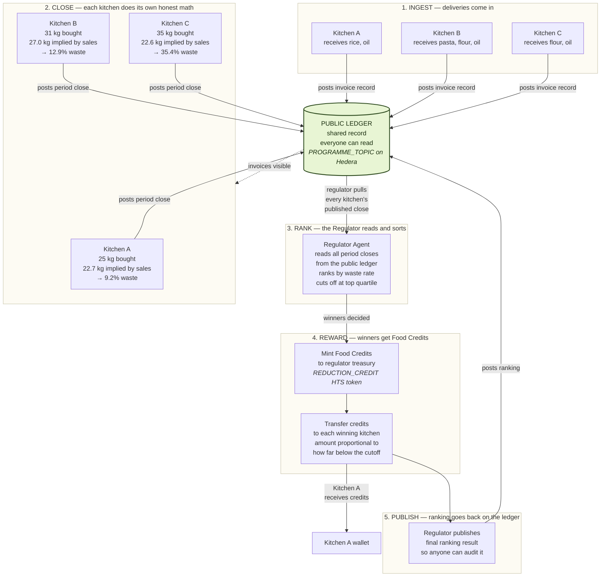
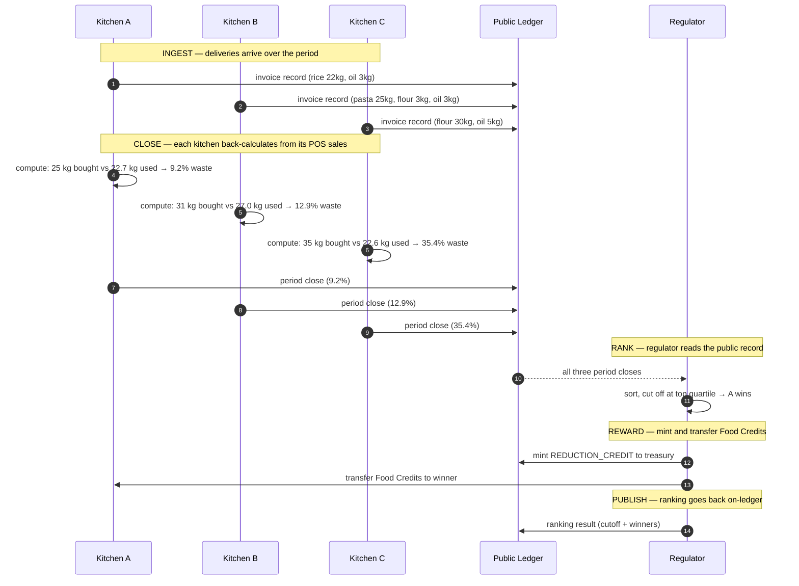

# Peel — Food Credits, explained in one picture

## What is this?

Peel's **Food Credits** system is a way to reward restaurants that waste less food, using a public record that anyone can check. Three kitchens log what ingredients they buy and what dishes they sell. At the end of each period, each kitchen does the math on itself — "here's what I bought, here's what my sales imply I actually used, here's the gap" — and posts the result to a public record. A separate Regulator agent reads those posts, ranks the kitchens, and mints digital **Food Credits** to the best performers. Nobody has to trust anyone. The arithmetic is open, the postings are open, the rewards are open. That's the whole pitch.

## The full cycle

## The same story, in time order

## Why this is interesting

The whole point of running this on a public ledger is that **nobody has to trust anybody**. Today, restaurants self-report their food waste and nobody can check the numbers. With Peel:

- **Kitchens can't lie about what they bought** — the invoice records are public and timestamped.
- **Kitchens can't lie about what they sold** — their sales imply their consumption via the recipe book, and that math is open.
- **The regulator can't play favourites** — the ranking rule is public, the inputs are public, and anyone can re-run the math and get the same answer.
- **The reward is real** — Food Credits are a live digital token (`REDUCTION_CREDIT`) on the Hedera network, transferred to the winners' wallets in a transaction anyone can look up.

Every step in the diagram above produces a receipt you can click on in [HashScan](https://hashscan.io/testnet). No central database, no private spreadsheet, no "trust us".

## How to view this diagram

You have three options, pick whichever is easiest:

1. **GitHub / GitLab** — push this file to a repo and open it in the web UI. Both platforms render Mermaid diagrams natively inside markdown previews. Zero setup.
2. **Mermaid Live Editor** — copy either code block above (the `flowchart TD` or the `sequenceDiagram`) into [mermaid.live](https://mermaid.live) for a full-screen, editable, exportable view. Best for tweaking.
3. **The HTML sibling** — open `food-credits-flowchart.html` (same folder) in any browser. It renders both diagrams with Peel's brand fonts and colours applied. No build step, no server — just double-click.

## How to edit

The diagrams are plain text inside this markdown file — scroll up and edit the code blocks directly. Mermaid syntax reference: <https://mermaid.js.org/intro/>. The HTML version reads its diagram source inline in the file, so if you change this `.md` you'll also want to mirror the change in `food-credits-flowchart.html`.
